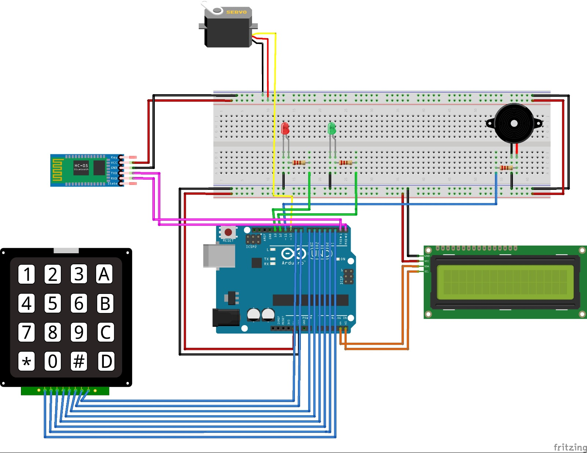
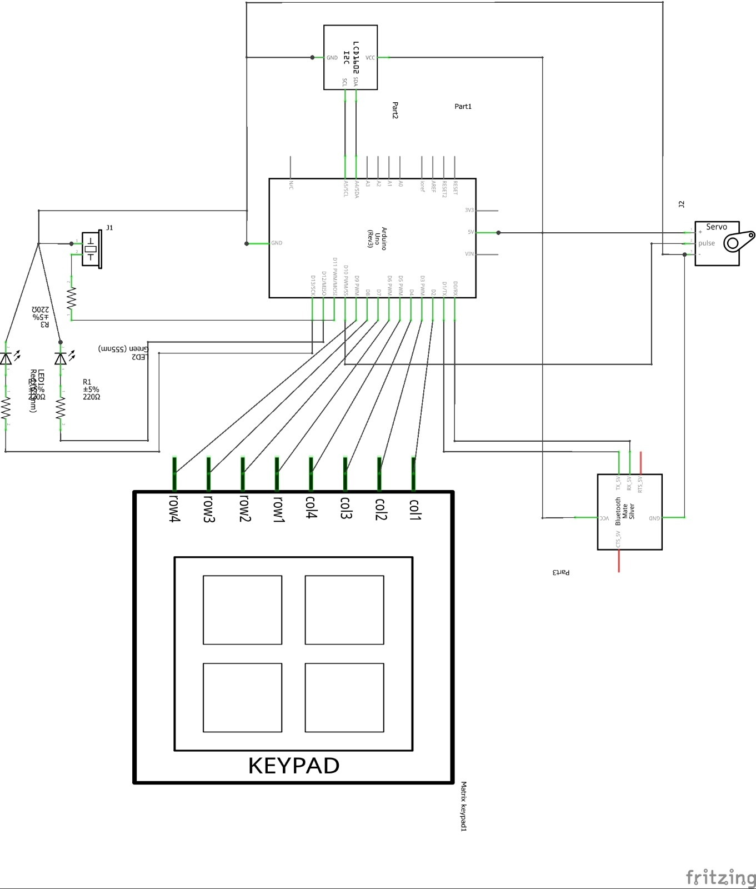
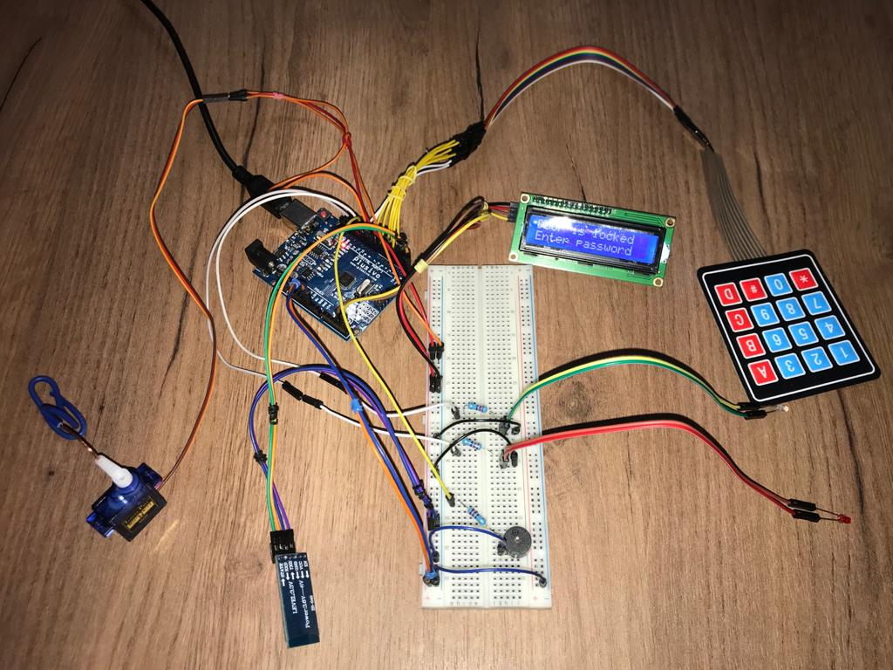
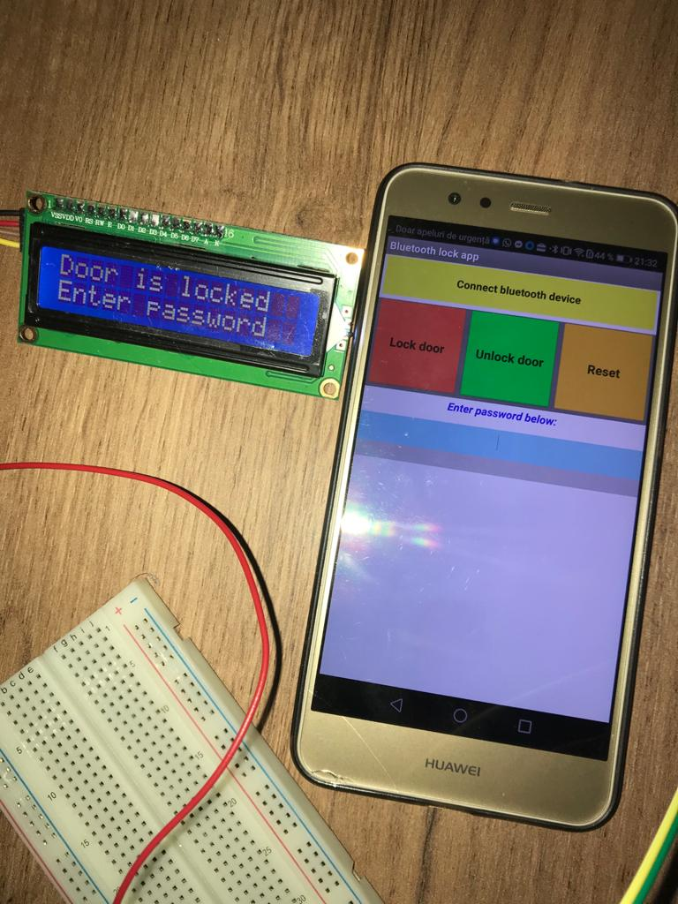
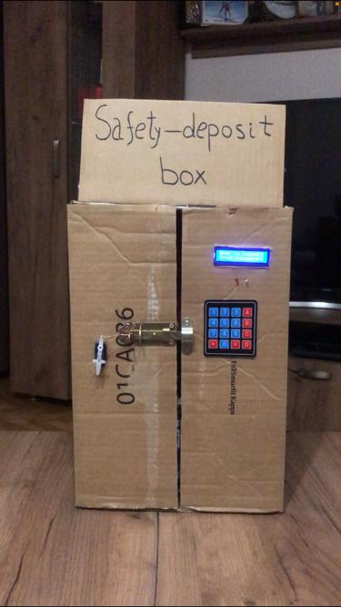
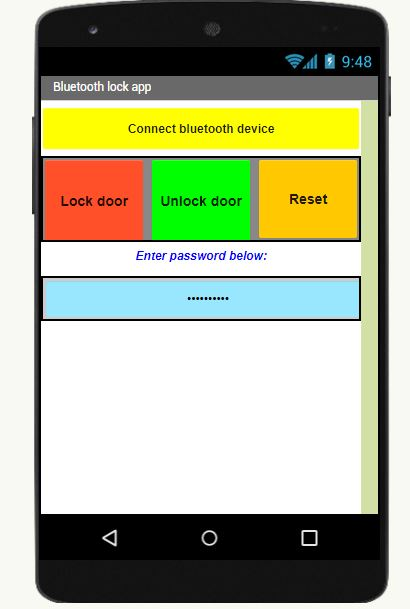

# Safety-deposit box lock

## Descriere și funcționalități:
- Am realizat un proiect hardware ce are la bază o plăcuță Arduino UNO. Proiectul consta în implementarea unei încuietori pentru un seif ce poate fi deschis si inchis prin tastarea unui cod la o tastatură matriceală 4x4. 

- Dacă va fi tastat codul corect atunci încuietoarea activată de un servomotor se va deschide, se va aprinde un bec verde si pe ecran va aparea mesajul "Correct password. Door unlocked". 

- Dacă se va tasta codul greșit (in incercarea de deblocare a seifului) atunci se va aprinde un bec roșu și pe ecranul LCD va apărea mesajul ”Wrong password. 2 attempts left”. 

- Dacă codul va fi introdus greșit de 3 ori (in incercarea de deblocare a seifului) se va activa o alarmă constituită dintr-un buzzer piezoelectric si pe ecran va aparea mesajul "Alarm ON. Enter reset code". 

- Pentru dezactivarea alarmei trebuie introdus un cod de resetare, diferit de codul de inchidere/deschidere pentru zavor. Dupa introducerea codului corect de resetare, alarma se va opri, insa usa va ramane blocata, fiind nevoie de introducerea parolei de deblocare pentru a deschide seiful.

- Daca codul de resetare este gresit va aparea mesajul "Wrong reset code. Enter reset code" si vor fi permise alte incercari.

- Seiful mai poate fi deblocat/blocat folosind o aplicație pe telefonul mobil bazata pe bluetooth. Tot prin aceasta aplicatie se poate opri alarma prin introducerea codului de resetare.

## Componente:
- _Placuta de dezvoltare Arduino UNO_
- _Servomotor SG90_
- _Modul LCD alfanumeric monocrom (cu conexiune I2C)_
- _Tastatura matriciala 4x4_
- _Modul Bluetooth HC-05_ 
- _Buzzer piezoelectric_
- _2 Leduri (verde si rosu)_
- _3 rezistente de 220Ω_ 

## Diagrama de componente:

## Schema electrica:

## Montajul realizat:
### Inainte de montarea pe cutie:

### Dupa montarea pe cutie:

## Detalii despre implementare:
- M-am folosit de 3 librarii: "Keypad.h", "Servo.h", "LiquidCrystal_I2C.h".

- Pentru inceput am testat motorul, apoi am conectat tastatura matriciala si am incercat sa controlez miscarile motorului prin apasarea unei taste, apoi prin apasarea mai multor taste ce reprezentau astfel o parola.

- Am adaugat ecranul LCD si am afisat tastele pe care le apasam, apoi le-am ascuns afisand "*" la fiecare apasare de tasta.

- In urma acestor teste am inceput implementarea propriu-zisa si am folosit mai multe structuri de tip "if" pentru a trata fiecare caz in parte:
    - Parola corecta -> deblocare/blocare seif
    - Parola incorecta pentru blocare -> mesaj de atentionare
    - Parola incorecta odata sau de 2 ori pentru deblocare -> mesaj de atentionare
    - Parola incorecta de 3 ori pentru deblocare-> activare alarma
    - Cod de resetare corect -> oprire alarma
    - Cod de resetare incorect -> mesaj de atentionare

- Am adaugat si 2 leduri (rosu si verde) pentru a fi mai usor de urmarit cand parola e corecta sau gresita.

- In final am conectat si modulul bluetooth si am folosit App Inevntor pentru implementarea aplicatiei Bluetooth. Initial am implementat doar 2 butoane: unul aprindea ledul verde, iar celalalt aprindea ledul rosu, pentru a intelege cum functioneaza atat modulul bluetooth, cat si aplicatia App Inventor.

- Aplicatia finala are 3 butoane si trimite pentru fiecare buton un semnal cu o alta valoare:
    - Butonul de deblocare -> '0'
    - Butonul de blocare -> '1'
    - Butonul de resetare -> '2'

## Probleme intampinate:
Cele mai multe probleme intampinate au fost la nivel hardware.
### Probleme software:
- Aplicatie bluetooth incompatibila cu IOS -> am folosit un telefon cu Android

### Probleme hardware:
- Cabluri insuficiente/prea scurte -> am cumparat mai multe cabluri

- Ruperea conectorului pentru bateria de 9V -> Am incercat sa conectez bateria cu cabluri dar nu a mers, deci am folosit    alimentarea la laptop

## Link catre filmuletul de prezentare:
[Video de prezentare](https://youtu.be/hYat2CCaaKQ)

## Proiecte similare:
- [Proiect similar 1](https://www.youtube.com/watch?v=q7AhM_JKIKg): Încuietoare de tip zăvor deschisă cu un servomotor prin tastarea unui cod pe o tastatură matriceală 4x4: 

- [Proiect similar 2](https://www.youtube.com/watch?v=xkLf84XIyL8&t=602s): Seif inchis doar cu un servomotor ce poate fi deschis prin tastarea unui cod la o tastatură matriceală 4x4

- [Proiect similar 3](https://www.youtube.com/watch?v=thTfswLiMTs): Încuietoare de tip zăvor deschisă cu un servomotor prin aplicație bluetooth pe telefon

